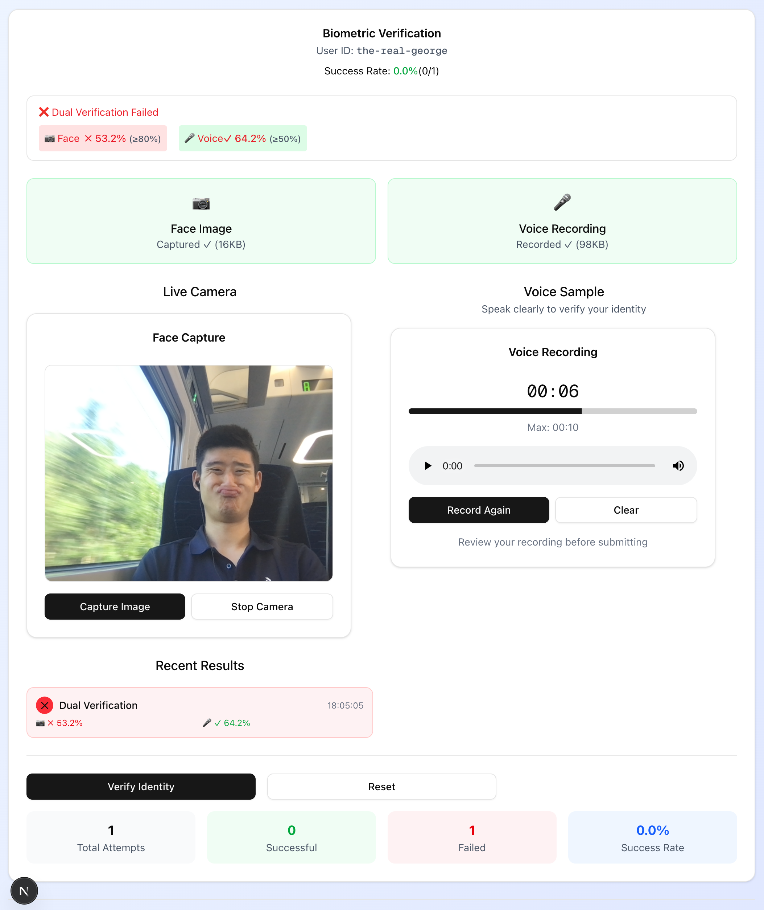
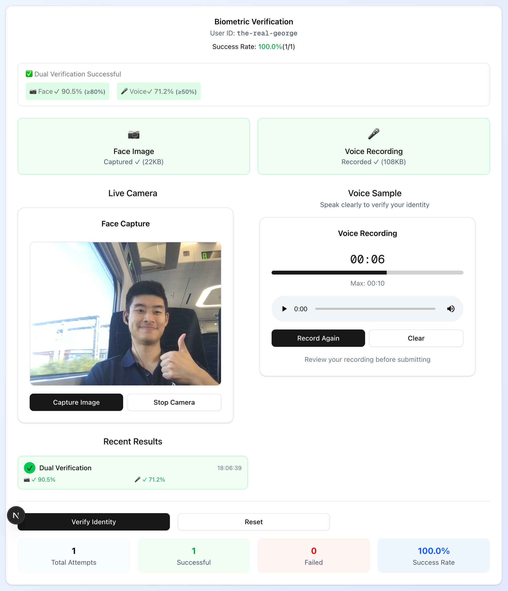

# Biometric Identity System - Web Application

## 🎯 Project Overview

A comprehensive **biometric authentication web application** using dual-modal face and voice recognition. The system implements an InferenceOps approach using pre-trained models for real-time identity verification through a modern web interface.



## 🏗️ System Architecture

```
┌─────────────────────────┐    ┌────────────────────────────┐
│     Web Frontend        │    │        Backend API         │
│                         │    │                           │
│ Next.js 14 + React      │◄──►│ FastAPI + ONNX Runtime    │
│ MediaDevices API        │    │ SpeechBrain + MediaPipe   │
│ Camera/Microphone       │    │ File-based Storage        │
│ Real-time UI            │    │ Dual-modal Verification   │
└─────────────────────────┘    └────────────────────────────┘
```

## 🚀 Quick Start with Docker

### Prerequisites
- Docker and Docker Compose
- At least 4GB RAM (for ML models)
- Webcam and microphone access

### Installation & Deployment

1. **Clone and setup:**
```bash
git clone <repository-url>
cd what-even-is-identity
```

2. **Download ML Models:**
```bash
cd backend
python download_models.py
cd ..
```

3. **Run with Docker Compose:**
```bash
docker-compose up --build
```

4. **Access the application:**
- Frontend: http://localhost:3000
- Backend API: http://localhost:8000
- API Documentation: http://localhost:8000/docs

### Manual Setup (Development)

**Backend:**
```bash
cd backend
pip install -r requirements.txt
python download_models.py
python run.py
```

**Frontend:**
```bash
cd frontend
npm install
npm run dev
```

## 🔧 Backend Architecture

### Core Services

**FastAPI Application Structure:**
- **main.py**: FastAPI app with CORS middleware and API routing
- **config.py**: Centralized settings with Pydantic (model paths, thresholds, limits)
- **Modular design**: Clean separation between services, models, and endpoints

**Biometric Processing Engine:**
- **Face Recognition**: FaceNet via ONNX Runtime (512-dim embeddings)
  - MediaPipe face detection with fallback to center crop
  - 160x160 preprocessing pipeline with normalization
  - 80% similarity threshold for verification
- **Voice Recognition**: SpeechBrain ECAPA-TDNN models
  - Automatic model downloading from HuggingFace
  - 16kHz mono audio processing with torchaudio
  - 50% similarity threshold for verification
- **Dual-modal Verification**: Both biometrics must pass for authentication




**Data Storage System:**
- **File-based JSON storage** for development (easily replaceable)
- **User profiles**: `/data/users/{user_id}.json` with embeddings
- **Verification history**: TTL-based caching with 100 attempt limit
- **Models**: Local ONNX files with automatic fallbacks

### API Endpoints

- `POST /api/v1/biometric/enroll` - User enrollment with face + voice
- `POST /api/v1/biometric/verify` - Identity verification
- `GET /api/v1/health` - System health check
- Full OpenAPI documentation at `/docs`

## 🎨 Frontend Architecture

### React/Next.js Application

**Main Components:**
- **Three-tab interface**: Enrollment, Verification, Live Verify
- **Backend health monitoring** with real-time status indicators
- **Toast notification system** for user feedback
- **Responsive design** with Tailwind CSS

**Biometric Capture Components:**

**CameraCapture Component:**
- MediaStream API integration with configurable constraints
- Canvas-based image capture (JPEG conversion)
- Auto-capture for continuous verification (3s intervals)
- Responsive video preview with error handling

**VoiceRecorder Component:**
- MediaRecorder API with WebM/Opus encoding
- Real-time recording timer with progress tracking
- Audio enhancement (echo cancellation, noise suppression)
- Built-in playback for recording review

**BiometricEnrollment Flow:**
- Two-phase process: Face capture → Voice recording
- Progress tracking (40% face + 40% voice + 20% completion)
- Real-time validation and success state management

**BiometricVerification Modes:**
- **Single verification**: Manual capture and verify
- **Continuous verification**: Auto-capture every 3 seconds
- Real-time history with success/failure metrics
- Dual-threshold feedback with detailed similarity scores

### User Experience Flow

1. **Setup**: Backend health check → User ID configuration
2. **Enrollment**: Sequential biometric capture with progress tracking
3. **Verification**: Single-shot or continuous modes with real-time feedback
4. **Analytics**: Comprehensive verification history and success rates

## 🤖 Machine Learning Models

### Model Architecture

**Face Recognition - FaceNet:**
- Pre-trained ONNX model for face embeddings
- 512-dimensional feature vectors
- Preprocessing: face detection → crop → resize → normalize
- Cosine similarity matching with 80% threshold

**Voice Recognition - SpeechBrain ECAPA-TDNN:**
- Speaker recognition from HuggingFace model hub
- Automatic model downloading and caching
- Audio preprocessing: format conversion → 16kHz mono
- Speaker embeddings with 50% similarity threshold

**Dual-modal Security:**
- Both face AND voice must pass verification
- Independent threshold configuration
- Comprehensive similarity scoring and logging

## 📊 Technical Stack

```yaml
Frontend:
  - Next.js 14 (React, TypeScript)
  - Tailwind CSS + Radix UI components
  - MediaDevices API (camera/microphone)
  - Axios for API communication
  - Toast notifications (Sonner)

Backend:
  - FastAPI (Python 3.11+)
  - ONNX Runtime for model inference
  - SpeechBrain for voice processing
  - MediaPipe for face detection
  - Pydantic for data validation
  - Uvicorn ASGI server

ML/AI:
  - FaceNet (face embeddings)
  - ECAPA-TDNN (voice embeddings)
  - NumPy/SciPy for similarity calculations
  - PyTorch ecosystem integration

Deployment:
  - Docker containers
  - Docker Compose orchestration
  - Volume persistence for models/data
  - Health checks and auto-restart
```

## 🔐 Security & Privacy

- **Local processing**: All biometric data processed on-premise
- **No cloud transmission**: Models and embeddings stored locally
- **Configurable thresholds**: Adjustable security levels
- **TTL caching**: Automatic cleanup of verification history
- **File validation**: Strict upload limits and format checking

## 🎯 Current Features

- ✅ **Dual-modal enrollment**: Face + voice sample capture
- ✅ **Real-time verification**: Single and continuous modes
- ✅ **Health monitoring**: System status and model availability
- ✅ **Verification analytics**: Success rates and attempt history
- ✅ **Responsive UI**: Mobile-friendly biometric capture
- ✅ **Docker deployment**: Production-ready containerization
- ✅ **Comprehensive documentation**: API docs and setup guides
